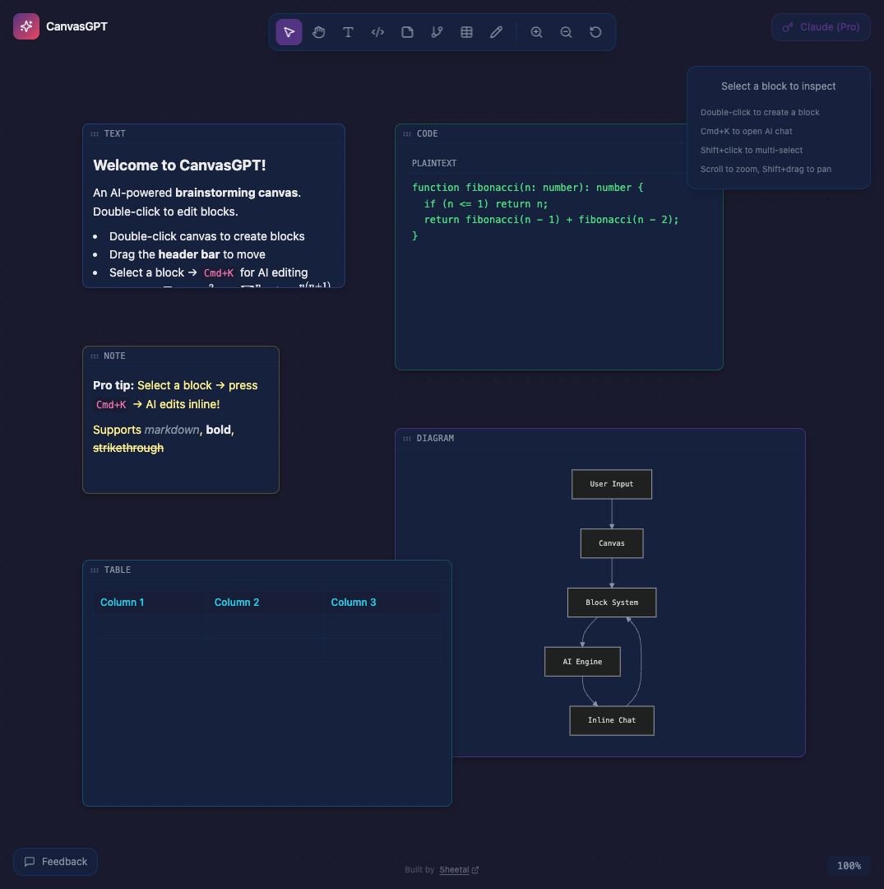

# CanvasGPT

An AI-powered brainstorming canvas with inline editing. Think Cursor + Notion AI + FigJam — on an infinite canvas.

**[Live Demo](https://canvasgpt.pages.dev)**



## Features

- **Infinite Canvas** — Pan, zoom, drag blocks freely
- **Inline AI Chat** — Select a block, press `Cmd+K`, edit with AI contextually
- **Block Types** — Text, Code, Notes, Diagrams, Tables, Drawing
- **Markdown Rendering** — Bold, italic, code, lists, blockquotes with live preview
- **Math Formulas** — Inline `$E=mc^2$` and block `$$\sum_{i=1}^n$$` via KaTeX
- **Mermaid Diagrams** — Write mermaid syntax, see rendered flowcharts/sequence diagrams
- **Interactive Tables** — Editable grid with add/remove rows & columns
- **Drawing Canvas** — Freehand drawing with color picker and stroke width
- **Multi-select** — Shift+click to select multiple blocks
- **Dual AI Providers** — Free (Gemini 2.5 Flash) or Pro (Claude with your own key)

## Tech Stack

| Layer | Tech |
|-------|------|
| Frontend | React 19, TypeScript, Vite |
| State | Zustand + Immer |
| Styling | Tailwind CSS |
| Markdown | react-markdown, remark-math, rehype-katex |
| Diagrams | Mermaid |
| AI | Anthropic Claude / Google Gemini |
| Deployment | Cloudflare Pages + Pages Functions |

## Getting Started

```bash
# Clone
git clone https://github.com/happycoder0011/CanvasGPT.git
cd CanvasGPT

# Install
npm install

# Run (starts client on :5173, server on :3001)
npm run dev
```

### AI Setup

**Free tier (default):** Uses Gemini 2.5 Flash — no key needed locally, works out of the box on the deployed version.

**Pro tier:** Click the provider button (top-right), switch to Claude, and paste your Anthropic API key. Stored in localStorage only.

**For deployment**, set the Gemini key as a Cloudflare secret:

```bash
wrangler pages secret put GEMINI_API_KEY --project-name canvasgpt
```

## How It Works

1. Double-click the canvas to create a block
2. Drag the header bar to move blocks
3. Double-click block content to edit
4. Select a block and press **Cmd+K** to open inline AI chat
5. AI returns structured actions (replace, append, insert, new_block) applied directly to your content

## Project Structure

```
CanvasGPT/
├── client/src/
│   ├── components/
│   │   ├── canvas/        # Infinite canvas with pan/zoom
│   │   ├── blocks/        # Text, Code, Note, Diagram, Table, Drawing
│   │   ├── inline-chat/   # Cmd+K AI chat popup
│   │   ├── toolbar/       # Tools + AI settings
│   │   └── inspector/     # Block properties panel
│   ├── stores/            # Zustand stores (canvas, chat, settings)
│   ├── hooks/             # useAI, useCanvasGestures, useKeyboard
│   └── types/             # TypeScript type definitions
├── functions/api/         # Cloudflare Pages Functions (AI proxy)
└── server/                # Express server (local dev)
```

## Deploy

```bash
npm run build:client
wrangler pages deploy dist --project-name canvasgpt
```

## Feedback

Have ideas or found a bug? [Send feedback](mailto:sheetalsinghnew@gmail.com) or open an issue.

---

Built by [Sheetal](https://sheetal.me)
